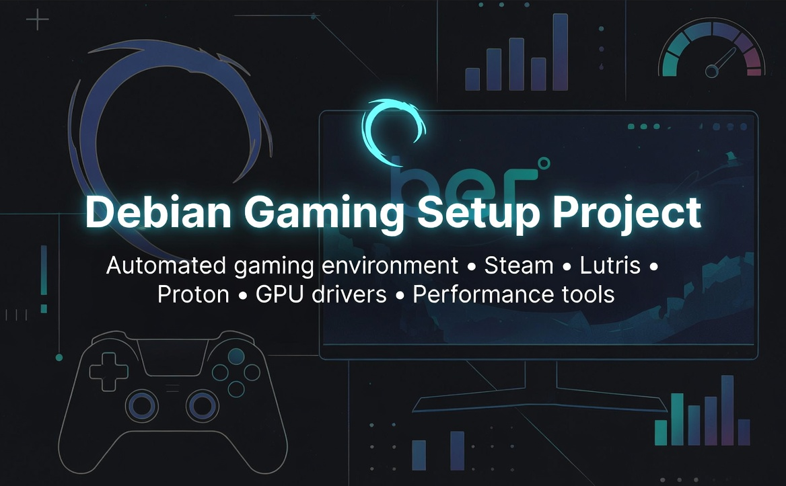

<p align="center">
  
</p>

---

<a name="top"></a>

<div align="center">

# Debian-Based Gaming Setup Script

### Transform your Debian-based Linux system into a complete gaming powerhouse

<!-- ═══ Dynamic Shields ═══ -->
<!-- CI badge — use shields.io static badge (GitHub-native badge.svg requires first workflow run) -->
[](https://github.com/Sandler73/Debian-Gaming-Setup-Project/actions/workflows/ci.yml)
[](https://github.com/Sandler73/Debian-Gaming-Setup-Project/actions)
[](https://github.com/Sandler73/Debian-Gaming-Setup-Project/blob/main/docs/SECURITY.md)

<!-- ═══ Static Shields ═══ -->
[](https://www.python.org/downloads/)
[](https://github.com/Sandler73/Debian-Gaming-Setup-Project/blob/main/LICENSE)
[](https://github.com/Sandler73/Debian-Gaming-Setup-Project/commits/main)

<!-- ═══ Platform & Language Shields ═══ -->
[](https://www.linux.org/)
[]()  <!-- Embedded launch_game.sh performance launcher -->
[]()
[](https://github.com/Sandler73/Debian-Gaming-Setup-Project/blob/main/CONTRIBUTING.md)

<!-- ═══ Project Metric Shields ═══ -->
[]()
[]()
[](https://github.com/Sandler73/Debian-Gaming-Setup-Project/wiki)

<!-- ═══ OS Support Shields ═══ -->
[](https://ubuntu.com/)
[](https://www.debian.org/)
[](https://linuxmint.com/)
[](https://zorin.com/)
[](https://pop.system76.com/)
[](https://www.kali.org/)

</div>

---

**[Full Documentation Wiki](https://github.com/Sandler73/Debian-Gaming-Setup-Project/wiki)** — detailed guides on utility, setup, execution and troubleshooting.

---

## 📋 Table of Contents

- [Supported Operating Systems](#-supported-operating-systems)
- [What's New](#-whats-new)
- [Quick Start](#-quick-start)
- [Key Features](#-key-features)
- [Installed Components](#-installed-components)
- [Hardware Support](#-hardware-support)
- [Usage Examples](#-usage-examples)
- [Command-Line Options](#%EF%B8%8F-command-line-options)
- [Rollback System](#-rollback-system)
- [Full Uninstall](#%EF%B8%8F-full-uninstall)
- [Post-Installation](#-post-installation)
- [File Locations](#-file-locations)
- [Documentation](#-documentation)
- [Troubleshooting](#-troubleshooting)
- [Contributing](#-contributing)
- [Project Stats](#-project-stats)
- [License](#-license)
- [Support](#-support)

---

## 🖥️ Supported Operating Systems

| Distribution | Versions | Status | Base | Notes |
|:---|:---|:---:|:---|:---|
|  | 22.04, 24.04 | ✅ Tested | — | Primary target, all editions |
|  | 21.x, 22.x | ✅ Tested | Ubuntu | Cinnamon, XFCE, MATE |
|  | 6 | ✅ Tested | Debian | Debian-based Mint |
|  | 22.04, 24.04 | ✅ Tested | Ubuntu | System76 derivative |
|  | 17 | ✅ Tested | Ubuntu | Pro & Core editions |
|  | 12 (Bookworm) | ✅ Tested | — | Stable only |
|  | Rolling | ✅ Tested | Debian | Maps to Debian codename |
|  | 7 (Horus) | ⚡ Compatible | Ubuntu 22.04 | Pantheon desktop |
|  | User Edition | ⚡ Compatible | Ubuntu 22.04 | KDE Plasma 6 |
| Other derivatives | — | ⚡ Compatible | Debian/Ubuntu | Via 7-step ID_LIKE fallback |

**Requirements:** Python 3.12+ · root/sudo · internet · 5+ GB disk · x86_64

<div align="right"><a href="#top">⬆ Back to top</a></div>

---

## 🌟 What's New

### v3.4.4 — CI/CD Overhaul & Node 24 Migration
- 🔄 **All GitHub Actions upgraded to v6** — Node 24 compatible, eliminates deprecation warnings
- 🧪 **8 lint checks** — Added f-string logging detection, test count regression guard, subprocess timeout verification
- 🚀 **Full release workflow** — Automated GitHub Releases with 3 archive formats and auto-generated notes
- 📊 **Pipeline summary** — GITHUB_STEP_SUMMARY tables for every run

### v3.4.3 — Wiki Expansion & Version Automation
- 📖 **15 wiki pages** (3,920 lines) — Launcher Guide, Setup Guide, expanded Architecture, Troubleshooting, and more
- 🔧 **`make version-bump`** — Single command syncs version across all files (11 patterns)

### v3.4.1–v3.4.2 — Audit Remediation & Bug Fixes
- 🐛 **3 runtime bugs fixed** — Mixed logging format TypeError, AMD GPU false detection, GE-Proton dry-run checksum
- 🧪 **136 tests** — 100% critical method coverage (was 19%)
- 🔒 **20 f-string logging calls eliminated** — All converted to lazy %-formatting

### v3.4.0 — Project Infrastructure
- 🏗️ **GitHub infrastructure** — FUNDING.yml, issue templates, PR template, .gitignore, LICENSE
- 🔧 **Makefile** — 43+ targets across 9 categories

[Full changelog](https://github.com/Sandler73/Debian-Gaming-Setup-Project/blob/main/docs/CHANGELOG.md)

<div align="right"><a href="#top">⬆ Back to top</a></div>

---

## 🚀 Quick Start

### One-Command Installation

```bash
# Download
wget https://raw.githubusercontent.com/Sandler73/Debian-Gaming-Setup-Project/main/debian_gaming_setup.py

# Interactive installation
sudo python3 debian_gaming_setup.py

# Or use a preset for automated installation
sudo python3 debian_gaming_setup.py --preset standard -y
```

### Presets

| Preset | What's Included |
|:---|:---|
| `--preset minimal` | GPU drivers + Steam + essentials + 32-bit |
| `--preset standard` | Minimal + Lutris + Wine + GameMode + MangoHud + GE-Proton + codecs |
| `--preset complete` | Standard + Heroic + ProtonUp-Qt + Goverlay + vkBasalt + Waydroid + SOBER + Discord + Mumble + mods + optimizations |
| `--preset streaming` | Steam + MangoHud + GameMode + Discord + optimizations |

### Verify Before Installing

```bash
sudo python3 debian_gaming_setup.py --check-requirements  # Validate system
sudo python3 debian_gaming_setup.py --preset standard --dry-run  # Preview changes
```

<div align="right"><a href="#top">⬆ Back to top</a></div>

---

## ⭐ Key Features

| Category | Feature | Details |
|:---|:---|:---|
| 🎮 **Platforms** | 8 gaming platforms | Steam, Lutris, Heroic, ProtonUp-Qt, SOBER, Waydroid, Discord, OBS |
| 🖥️ **GPU** | All vendors | NVIDIA, AMD, Intel — fully dynamic detection and driver selection |
| 🖱️ **VM** | 6 hypervisors | VMware, VirtualBox, KVM, Hyper-V, Xen, Parallels |
| ⚡ **Performance** | 5 tools | GameMode, MangoHud, Goverlay, vkBasalt, GreenWithEnvy |
| 🔄 **Rollback** | 7 action types | APT, Flatpak, repos, files, sysctl, GE-Proton — LIFO reversal |
| 🗑️ **Uninstall** | Full removal | Categorized inventory, reverse-dependency order, confirmation gates |
| 📋 **CLI** | 43 arguments | 9 groups, 4 presets, dry-run, auto-yes |
| 🔒 **Security** | Audited | STRIDE model, CWE/SANS Top 25, no shell=True, no eval |
| 🧪 **Testing** | 136 tests | Unit, integration, security, host safety |
| 🔧 **CI/CD** | 4 jobs | Lint, test (3.12+3.13), security scan, release |

<div align="right"><a href="#top">⬆ Back to top</a></div>

---

## 📦 Installed Components

### Gaming Platforms & Launchers

| Component | Package | Install Method | Pre-Detection |
|:---|:---|:---:|:---:|
| Steam | `steam` / `steam-installer` | APT | ✅ version + update |
| Lutris | `lutris` / `net.lutris.Lutris` | APT / Flatpak | ✅ version + update |
| Heroic Games Launcher | `com.heroicgameslauncher.hgl` | Flatpak | ✅ version + update |
| ProtonUp-Qt | `net.davidotek.pupgui2` | Flatpak | ✅ version + update |
| SOBER (Roblox) | `org.vinegarhq.Sober` | Flatpak | ✅ version + update |
| Waydroid (Android) | `waydroid` | APT | ✅ version + update |

### Compatibility Layers

| Component | Package | Verification |
|:---|:---|:---|
| Wine Staging | `winehq-staging` | WineHQ repo codename validation |
| Winetricks | `winetricks` | APT version check |
| GE-Proton | GitHub release | SHA512 checksum verification |

### Performance & Monitoring

| Component | Package | Purpose |
|:---|:---|:---|
| GameMode | `gamemode` | CPU/GPU optimization during gameplay |
| MangoHud | `mangohud` + `:i386` | FPS/performance HUD overlay |
| Goverlay | `goverlay` | MangoHud GUI configurator |
| vkBasalt | `vkbasalt` | Vulkan post-processing (sharpening, CAS) |
| GreenWithEnvy | `com.leinardi.gwe` | NVIDIA GPU fan curve and clock control |
| Performance Launcher | `~/launch-game.sh` | GameMode + MangoHud + CPU governor wrapper |

### Communication & Utilities

| Component | Package | Install Method |
|:---|:---|:---:|
| Discord | `discord` / `com.discordapp.Discord` | APT / Flatpak |
| OBS Studio | `obs-studio` / `com.obsproject.Studio` | APT / Flatpak |
| Mumble | `mumble` | APT |
| r2modman | `com.thunderstore.r2modman` | Flatpak |
| Controller support | `xboxdrv`, `antimicrox` | APT |

<div align="right"><a href="#top">⬆ Back to top</a></div>

---

## 🔩 Hardware Support

| GPU Vendor | Detection | Driver Source | Features |
|:---|:---|:---|:---|
| **NVIDIA** | `lspci` + `ubuntu-drivers` | Dynamic version selection | Proprietary drivers, CUDA, Vulkan |
| **AMD** | `lspci` | Mesa + AMDGPU | Vulkan, 32-bit compatibility, firmware-aware |
| **Intel** | `lspci` | Mesa + i915 | Media acceleration, Arc GPU support |

| VM Platform | Guest Tools | Auto-Detected |
|:---|:---|:---:|
| VMware | `open-vm-tools` + desktop | ✅ |
| VirtualBox | `virtualbox-guest-utils` | ✅ |
| KVM/QEMU | `qemu-guest-agent` + `spice-vdagent` | ✅ |
| Hyper-V | `hyperv-daemons` | ✅ |
| Xen | `xe-guest-utilities` | ✅ |
| Parallels | `parallels-tools` | ✅ |

<div align="right"><a href="#top">⬆ Back to top</a></div>

---

## 🎯 Usage Examples

### Complete Setups

```bash
# NVIDIA Gaming PC (Maximum Features)
sudo python3 debian_gaming_setup.py -y \
    --nvidia --all-platforms --sober --wine --ge-proton \
    --gamemode --mangohud --gwe --vkbasalt \
    --discord --obs --mod-managers --controllers \
    --essential --codecs --optimize --launcher

# AMD Gaming PC
sudo python3 debian_gaming_setup.py -y \
    --amd --all-platforms --wine --ge-proton \
    --gamemode --mangohud --vkbasalt \
    --discord --controllers --essential --codecs --optimize

# Intel Laptop (Battery-Conscious)
sudo python3 debian_gaming_setup.py -y \
    --intel --steam --lutris --wine \
    --gamemode --essential --codecs
```

### Maintenance Operations

```bash
sudo python3 debian_gaming_setup.py --update           # Update installed components
sudo python3 debian_gaming_setup.py --rollback          # Undo last installation session
sudo python3 debian_gaming_setup.py --uninstall         # Full removal of all components
sudo python3 debian_gaming_setup.py --self-update       # Check for script updates
sudo python3 debian_gaming_setup.py --check-requirements # Validate system
```

<div align="right"><a href="#top">⬆ Back to top</a></div>

---

## 🎛️ Command-Line Options

### Quick Reference

```
General:          --dry-run, --yes/-y, --verbose, --skip-update
GPU/Drivers:      --nvidia, --amd, --intel, --vm-tools
Platforms:        --steam, --lutris, --heroic, --protonup, --sober, --waydroid, --all-platforms
Compatibility:    --wine, --ge-proton
Performance:      --gamemode, --mangohud, --goverlay, --gwe, --vkbasalt, --optimize, --launcher
Communication:    --discord, --obs, --mumble
System:           --essential, --codecs, --32bit, --mod-managers, --controllers
Maintenance:      --rollback, --uninstall, --update, --self-update, --check-requirements, --cleanup
Presets:          --preset minimal|standard|complete|streaming
```

<div align="right"><a href="#top">⬆ Back to top</a></div>

---

## 🔄 Rollback System

Every reversible operation is automatically tracked. The rollback engine records 7 action types:

| Action Type | What's Tracked | Reversal |
|:---|:---|:---|
| `apt_install` | APT package installs | `apt-get remove` |
| `flatpak_install` | Flatpak app installs | `flatpak uninstall` |
| `repo_add` | Repository additions | Remove repo files + update |
| `file_create` | Files created by script | Remove file |
| `file_modify` | Files modified (backed up) | Restore from backup |
| `sysctl_write` | sysctl config changes | Remove + reload |
| `ge_proton_install` | GE-Proton extraction | Remove directory |

```bash
sudo python3 debian_gaming_setup.py --rollback --dry-run  # Preview
sudo python3 debian_gaming_setup.py --rollback             # Execute
```

<div align="right"><a href="#top">⬆ Back to top</a></div>

---

## 🗑️ Full Uninstall

For complete removal of all gaming components installed by the script:

```bash
sudo python3 debian_gaming_setup.py --uninstall
```

The uninstall mode:

1. **Scans** for all installed gaming components (APT packages, Flatpak apps, GE-Proton, config files)
2. **Displays** a categorized inventory with versions
3. **Confirms** before proceeding
4. **Removes** in reverse dependency order (Flatpak → APT → autoremove → GE-Proton → configs → state)
5. **Reports** results with error details

This differs from `--rollback` which only undoes the last session. `--uninstall` finds all known components regardless of when they were installed.

<div align="right"><a href="#top">⬆ Back to top</a></div>

---

## 🎮 Post-Installation

1. **Reboot** — `sudo reboot` (required for GPU drivers)
2. **Verify GPU** — `nvidia-smi` or `glxinfo | grep renderer`
3. **Configure Steam** — Settings → Compatibility → Enable Steam Play → Proton Experimental
4. **Test a game** — Native: CS2, Portal 2 | Proton: Stardew Valley, Terraria
5. **Performance launcher** — `~/launch-game.sh steam`

<div align="right"><a href="#top">⬆ Back to top</a></div>

---

## 📁 File Locations

| File | Path | Purpose |
|:---|:---|:---|
| Logs | `~/gaming_setup_logs/gaming_setup_*.log` | Timestamped operation logs |
| State | `~/gaming_setup_logs/installation_state.json` | Installed component inventory |
| Rollback | `~/gaming_setup_logs/rollback_manifest.json` | Action history for rollback |
| Backups | `~/gaming_setup_backups/` | Pre-modification file backups |
| Launcher | `~/launch-game.sh` | Performance game launcher |
| MangoHud | `~/.config/MangoHud/MangoHud.conf` | HUD overlay settings |
| vkBasalt | `~/.config/vkBasalt/vkBasalt.conf` | Post-processing config |

<div align="right"><a href="#top">⬆ Back to top</a></div>

---

## 📖 Documentation

| Document | Purpose | Best For |
|:---|:---|:---|
| **[Wiki](https://github.com/Sandler73/Debian-Gaming-Setup-Project/wiki)** | Complete documentation hub (13 pages) | Everyone |
| [Quick_Start.md](https://github.com/Sandler73/Debian-Gaming-Setup-Project/blob/main/docs/Quick_Start.md) | Step-by-step first-run guide | First-time users |
| [Usage_Guide.md](https://github.com/Sandler73/Debian-Gaming-Setup-Project/blob/main/docs/Usage_Guide.md) | Complete reference with all options | All users |
| [FAQ.md](https://github.com/Sandler73/Debian-Gaming-Setup-Project/blob/main/docs/FAQ.md) | 50+ questions across 12 categories | Quick answers |
| [CHANGELOG.md](https://github.com/Sandler73/Debian-Gaming-Setup-Project/blob/main/docs/CHANGELOG.md) | Version history from v1.0 to v3.4.2 | Tracking changes |
| [SECURITY.md](https://github.com/Sandler73/Debian-Gaming-Setup-Project/blob/main/docs/SECURITY.md) | Security model and vulnerability reporting | Security researchers |
| [CONTRIBUTING.md](https://github.com/Sandler73/Debian-Gaming-Setup-Project/blob/main/CONTRIBUTING.md) | Contribution guide and code standards | Contributors |
| [LAUNCHER_GUIDE.md](https://github.com/Sandler73/Debian-Gaming-Setup-Project/blob/main/docs/LAUNCHER_GUIDE.md) | Performance launcher documentation | Power users |

<div align="right"><a href="#top">⬆ Back to top</a></div>

---

## 🛠 Troubleshooting

### Common Issues

**"Package has no installation candidate"** — Run `sudo apt-get update`. On ZorinOS/derivatives, the script (v3.3.0+) automatically skips unavailable packages.

**System upgrade hangs** — Fixed in v3.2.0 with dpkg `--force-confold`. update to v3.5.0 or re-run with `--skip-update`.

**NVIDIA driver not loading** — Disable Secure Boot in BIOS. Run `sudo apt purge nvidia-* && sudo python3 debian_gaming_setup.py --nvidia`.

**Steam won't launch** — Run `steam` from terminal to see errors. Try `rm -rf ~/.steam/steam/appcache/`.

**MangoHud not showing** — Use `MANGOHUD=1 %command%` in Steam Launch Options. Config: `~/.config/MangoHud/MangoHud.conf`.

**Check logs** — `cat ~/gaming_setup_logs/gaming_setup_*.log | tail -100`

[Full troubleshooting guide](https://github.com/Sandler73/Debian-Gaming-Setup-Project/wiki/Troubleshooting-Guide) | [FAQ](https://github.com/Sandler73/Debian-Gaming-Setup-Project/wiki/Frequently-Asked-Questions)

<div align="right"><a href="#top">⬆ Back to top</a></div>

---

## 🤝 Contributing

Contributions welcome! See [CONTRIBUTING.md](https://github.com/Sandler73/Debian-Gaming-Setup-Project/blob/main/CONTRIBUTING.md) for guidelines.

```bash
# Development setup
git clone https://github.com/Sandler73/Debian-Gaming-Setup-Project.git
cd Debian-Gaming-Setup-Project
make install-dev   # Install pytest, pre-commit
make check         # Run all quality gates (lint + test + security)
```

<div align="right"><a href="#top">⬆ Back to top</a></div>

---

## 📊 Project Stats

| Metric | Value |
|:---|:---|
| **Script version** | v3.5.0 |
| **Lines of code** | 5,796 |
| **Python version** | 3.12+ (StrEnum, slots, walrus, PEP 585/604) |
| **CLI arguments** | 43 across 9 groups |
| **GamingSetup methods** | 92+ |
| **Automated tests** | 136 (42 unit, 24 integration, 46 extended integration, 24 security/host safety) |
| **CI/CD pipeline** | 4 jobs (lint, test matrix, security scan, release) |
| **Gaming platforms** | 8 |
| **Performance tools** | 5 |
| **Supported distributions** | 10+ (tested) |
| **Wiki pages** | 13 |
| **Configuration presets** | 4 (minimal, standard, complete, streaming) |
| **Rollback action types** | 7 |
| **External dependencies** | 0 — Python standard library only |
| **Security audit** | STRIDE + CWE/SANS Top 25 mapped |

<div align="right"><a href="#top">⬆ Back to top</a></div>

---

## 📜 License

[MIT License](https://github.com/Sandler73/Debian-Gaming-Setup-Project/blob/main/LICENSE) — Free to use, modify, and distribute. See LICENSE for liability limitation and warranty disclaimer.

---

## ⚠️ Disclaimer

This script makes system-level changes. Always backup important data, test with `--dry-run` first, review logs for errors, and understand what's being installed. **Use at your own risk.** No warranty provided.

<div align="right"><a href="#top">⬆ Back to top</a></div>

---

## 💬 Support

<div align="center">

| Resource | Link |
|:---|:---|
| 📖 **Wiki & Guides** | [github.com/Sandler73/Debian-Gaming-Setup-Project/wiki](https://github.com/Sandler73/Debian-Gaming-Setup-Project/wiki) |
| ❓ **FAQ** | [50+ Questions Answered](https://github.com/Sandler73/Debian-Gaming-Setup-Project/blob/main/docs/FAQ.md) |
| 🐛 **Report a Bug** | [Open Bug Report](https://github.com/Sandler73/Debian-Gaming-Setup-Project/issues/new?template=bug_report.yml) |
| ✨ **Request Feature** | [Open Feature Request](https://github.com/Sandler73/Debian-Gaming-Setup-Project/issues/new?template=feature_request.yml) |
| 🔒 **Security Issue** | [Private Security Advisory](https://github.com/Sandler73/Debian-Gaming-Setup-Project/security/advisories/new) |
| 💬 **Discussions** | [GitHub Discussions](https://github.com/Sandler73/Debian-Gaming-Setup-Project/discussions) |
| 💝 **Sponsor** | [GitHub Sponsors](https://github.com/sponsors/Sandler73) |
| 📧 **Contact** | [Open an Issue](https://github.com/Sandler73/Debian-Gaming-Setup-Project/issues) |

</div>

### Getting Help

1. **Check the [FAQ](https://github.com/Sandler73/Debian-Gaming-Setup-Project/blob/main/docs/FAQ.md)** — 50+ questions across 12 categories
2. **Read the [Troubleshooting Guide](https://github.com/Sandler73/Debian-Gaming-Setup-Project/wiki/Troubleshooting-Guide)** — Common issues and solutions
3. **Search [existing issues](https://github.com/Sandler73/Debian-Gaming-Setup-Project/issues)** — Your question may already be answered
4. **Open a new issue** — Use the structured issue templates for fastest response
5. **Include your logs** — `cat ~/gaming_setup_logs/gaming_setup_*.log | tail -50`

### Supporting the Project

If this script helped you, consider:

- ⭐ **Starring** the repository
- 🐛 **Reporting bugs** you encounter
- 📝 **Contributing** code, docs, or translations
- 💝 **Sponsoring** via [GitHub Sponsors](https://github.com/sponsors/Sandler73)
- 📢 **Sharing** with fellow Linux gamers

<div align="right"><a href="#top">⬆ Back to top</a></div>

---

<div align="center">

**⭐ Star this repo if it helped you! ⭐**

Made with ❤️ for the Linux gaming community

**Version 3.5.0** | Updated March 2026

[Report Issue](https://github.com/Sandler73/Debian-Gaming-Setup-Project/issues) · [Request Feature](https://github.com/Sandler73/Debian-Gaming-Setup-Project/issues/new?template=feature_request.yml) · [Contribute](https://github.com/Sandler73/Debian-Gaming-Setup-Project/blob/main/CONTRIBUTING.md) · [Wiki](https://github.com/Sandler73/Debian-Gaming-Setup-Project/wiki)

</div>
